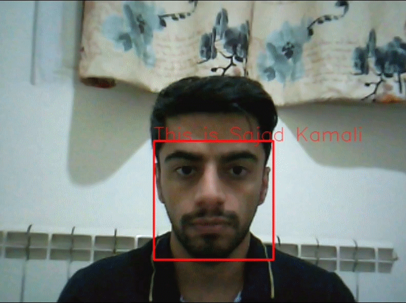

# Face Recognition using OpenCV and face_recognition

This is a Python code that utilizes the `face_recognition` library and OpenCV to perform real-time face recognition on a video feed from a webcam. The code matches the detected faces with pre-trained known faces and displays the name of the recognized person on the video frame.

## Prerequisites

Before running this code, make sure you have the following installed:

- Python 3.x
- OpenCV (cv2) library
- face_recognition library

You can install the necessary libraries using pip:

```
pip install opencv-python
pip install face-recognition
```

## Usage

1. Clone the repository or download the source code file.

2. Run the following command in your terminal to execute the code:
   
   ```
   python face_recognition.py
   ```

3. The program will access the webcam and display the video feed.

4. The code loads pre-trained face encodings and names from the `known_face.pickle` file. Make sure you have this file in the same directory as the script.

5. As faces are detected in the video feed, the code compares them with the known face encodings and displays the recognized names on top of the faces.

6. Press 'q' to quit the program.

Note: You may need to adjust the face recognition parameters according to your requirements. The current threshold for matching faces is set to 0.4 (`results = face_recognition.compare_faces(encodings, encod, 0.4)`).

Feel free to modify the code to fit your specific needs and integrate it into your projects!

## Example



## Credits
This code was developed by Sajad Kamali.
